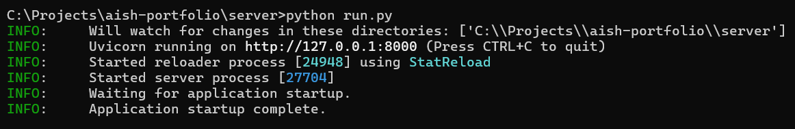
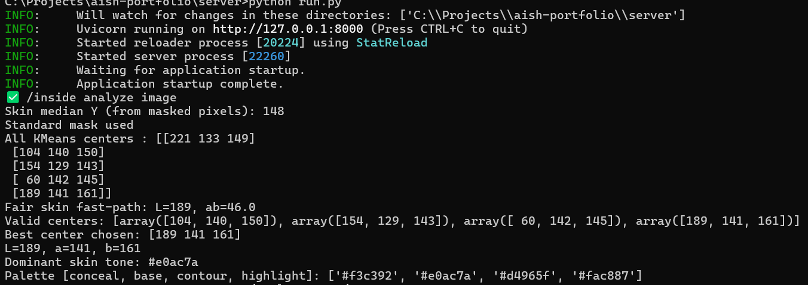

# Backend — Skin Tone Analysis & Product Recommendations

The backend for the Face Analyser web app. Built with FastAPI and Python. It accepts a face image, runs a computer vision pipeline to detect skin tone and undertone, returns a full personalised colour profile as JSON, and matches that profile against a real product catalogue (foundation, blush, lip, eye, highlight) to recommend shades that actually suit the user.

---

## Tech Stack

- **FastAPI** — API framework
- **Pydantic** — request/response validation (recommendations API)
- **OpenCV** — image processing and colour space conversions
- **scikit-learn** — KMeans clustering for dominant skin tone detection
- **NumPy** — numerical operations
- **Pillow** — image handling
- **pytest** — test suite (`tests/`)

---

## How It Works

### Skin tone analysis (`/analyze`)

1. The uploaded image is decoded and passed through a YCrCb colour space mask to isolate skin pixels
2. A center-weighted ellipse mask discards background pixels
3. Skin pixels are converted to LAB colour space — perceptually uniform, making similar-looking colours cluster together accurately
4. KMeans clustering (5 clusters) finds the dominant skin tone
5. A scoring function selects the best cluster, rejecting background bleed and specular highlights
6. Undertone (warm / cool / neutral) is classified from the LAB a and b channel values
7. All palette colours (lip, blush, jewel tones, warm/cool/dark palettes) are derived mathematically from the detected skin LAB values and converted back to hex for CSS/web rendering

### Product recommendations (`/recommendations/{user_id}`)

1. Takes the profile returned by `/analyze` and matches it against a catalogue of real products, one shelf per category (foundation, blush, lip, eye, highlight)
2. **Foundation** and most categories are matched directly against the user's skin hex in LAB colour space (CIE76 Delta E) — the closest real shade wins
3. **Blush** is matched against the profile's own undertone-aware `blush_shades` palette instead of raw skin hex, since real blush pigments are deliberately pinker than skin — matching them to skin colour directly would reject almost every real product
4. Products scoring below a match threshold, or with no verified real name/image/price, are dropped from the shelf rather than shown as filler
5. The catalogue itself (`foundation.json`, `blush.json`, `lip.json`) is generated by `scripts/build_catalogue.py` from public shade datasets and makeup-api.herokuapp.com — see that file's docstring for the full data-source breakdown

---

## Project Structure

```
server/
├── app/
│   ├── main.py                        # FastAPI app, CORS config
│   ├── api/
│   │   └── routes.py                  # /ping, /analyze — mounts the recommendations router
│   ├── core/
│   │   └── image_processing.py        # Full CV pipeline — skin detection, undertone, palette derivation
│   └── recommendations/
│       ├── router.py                  # POST /recommendations/{user_id}
│       ├── matcher.py                 # LAB colour-distance matching (Delta E)
│       ├── catalogue.py               # Loads generated + hand-written product categories
│       ├── models.py                  # Pydantic request/response schemas
│       └── data/                      # Generated catalogue JSON (foundation, blush, lip)
├── scripts/
│   └── build_catalogue.py             # Regenerates the data-driven catalogue categories
├── tests/                             # pytest suite
├── run.py                             # Local dev server runner
└── requirements.txt
```

---

## Getting Started

**Clone the repo**
```bash
git clone https://github.com/aishwindersandhu/faceApp
cd faceApp
git checkout server
```

**Create and activate a virtual environment**
```bash
python -m venv venv

# macOS / Linux
source venv/bin/activate

# Windows
venv\Scripts\activate
```

**Install dependencies**
```bash
pip install -r requirements.txt
```

**Run the server**
```bash
python run.py
```

---

## API

### `POST /ping`
Health check.

**Response**
```json
{ "message": "pong" }
```

---

### `POST /analyze`

Accepts a face image and returns skin tone data with a full colour profile.

**Request**
```
Content-Type: multipart/form-data
Body: image (File) — JPG, PNG, or WEBP
```

**Response**
```json
{
  "filename": "photo.jpg",
  "skinTone": "Medium",
  "colorCode": "#a79272",
  "colorPalette": ["#b8a282", "#a79272", "#8c7255", "#beab82"],
  "profile": {
    "undertone": "warm",
    "contrast": "medium",
    "depth": "Medium",
    "L": 148, "a": 142, "b": 151,
    "warm_palette":  [{ "name": "Camel",       "hex": "#b8935a" }, "..."],
    "cool_palette":  [{ "name": "Navy",         "hex": "#3a4a6b" }, "..."],
    "dark_palette":  [{ "name": "Wine",         "hex": "#6b2d3a" }, "..."],
    "jewel_tones":   [{ "name": "Ruby",         "hex": "#8b3a4a" }, "..."],
    "lip_shades":    [{ "name": "Coral",        "hex": "#c4705a" }, "..."],
    "blush_shades":  [{ "name": "Peach Blush",  "hex": "#d4a888" }, "..."]
  }
}
```

`colorPalette` order: `[Conceal, Base, Contour, Highlight]`

---

### `POST /recommendations/{user_id}`

Accepts the `profile` object from `/analyze` (passed straight through) and returns a shelf of matched, real products per category.

**Request**
```json
{
  "skinTone": "Medium",
  "colorCode": "#BD8453",
  "colorPalette": ["#b8a282", "#a79272", "#8c7255", "#beab82"],
  "profile": { "...": "the full profile object from /analyze" }
}
```

**Response**
```json
{
  "toneLabel": "Medium Warm",
  "matchPercent": 82,
  "avoidColors": ["#B0C4DE", "#C0C0C0", "..."],
  "avoidLabel": "Avoid these",
  "avoidDescription": "Cool tones and silver metallics wash out warm undertones",
  "categories": [
    {
      "key": "foundation",
      "label": "Foundation",
      "icon": "🫧",
      "products": [
        {
          "id": "fenty-beauty-pro-filtr",
          "brand": "Fenty Beauty",
          "name": "PRO FILT'R - Soft Matte Longwear Foundation",
          "image": "https://...",
          "matchPercent": 93,
          "isTopPick": true,
          "price": "₹3,230",
          "darkBackground": false,
          "shades": [{ "name": "230 Neutral", "hex": "#c8906a" }]
        }
      ]
    }
  ]
}
```

Products with no confirmed price show `"price": "Price unavailable"` rather than a placeholder dash — see `router.py`'s `_display_price`.

---

## Regenerating the product catalogue

Foundation, blush, and lip are generated from public shade data, not hand-written:

```bash
python scripts/build_catalogue.py [--refresh]
```

- `foundation.json` — built from The Pudding's "Shades of You" dataset (base shade hexes), enriched with real name/image/price from makeup-api.herokuapp.com, then allShades.csv (Sephora/Ulta), then a manually-downloaded Nykaa scrape for Indian brands, in that order. Products with no real match anywhere are marked `unverified` and hidden from the API response rather than shown with a placeholder.
- `blush.json` / `lip.json` — built entirely from makeup-api.herokuapp.com, which is self-sufficient for these (real name, image, price, and per-shade hex all in one source).
- Eye and Highlight remain hand-written in `catalogue.py` — no equivalent public dataset fit those categories cleanly.

See the docstrings in `scripts/build_catalogue.py` for the full source breakdown, matching thresholds, and known data-quality fixes (HTML-entity cleanup, multi-hex swatch splitting, brand-name casing, a manual override table for products no automated source can price or name).

---

## Testing

```bash
pytest
```

65 tests covering the CV pipeline's colour math, the catalogue matcher, catalogue-building logic, and the recommendations API contract.

---

## Logs

The server logs key steps so you can trace detection results during development.

**Successful server start**



**Successful image processing**



---

## Requirements

```
fastapi
uvicorn
pillow
python-multipart
opencv-python-headless
numpy
scikit-learn
```

---

## Roadmap

- [ ] Integrate MediaPipe for more accurate face region detection
- [ ] Reduce light sensitivity in detection pipeline
- [ ] Proper error handling and fallback responses
- [ ] Add authentication layer for the API
- [ ] Improve accuracy of the data returned, make it more light insensitive
- [ ] Integrate LLM models for further exploration
- [ ] Explore more from color theory
- [ ] Real product data (name/image/price) for the remaining unverified Indian foundation brands (Bharat & Doris, Blue Heaven, House of Tara, Lotus Herbals) — no free dataset currently covers them
- [ ] Swap the fixed USD→INR conversion rate for a live FX rate

---

## Limitations

- Hosted on Render's free tier so the first request may take 30–60 seconds to wake up — subsequent requests are fast.
- Currently only works well with Light medium to Deep colors. Fair and pale skin tones are still not returning the desired output.
- The product catalogue (218 products shown across all categories) has real pricing for ~93% of shown products; the rest show "Price unavailable" rather than a guessed number — mostly small indie brands with no confirmed Indian retail listing.
- Foundation brand coverage skews toward global/US-UK brands; several Indian brands (Lakmé, Nykaa, Colorbar) are represented but only for fair-to-medium shade ranges, since that's what their matched real product data covers.

## Contact

Reach out at [aishwinder.sandhu@gmail.com](mailto:aishwinder.sandhu@gmail.com) or on [LinkedIn](https://www.linkedin.com/in/aishwinder-sandhu-3b5002102/)
