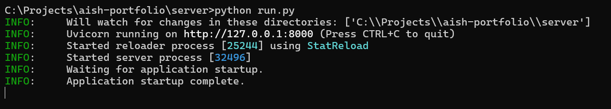
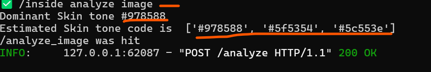

# Face Analyser 
- This project is the backend side of the Face Analyser which is already developed in React, TypeScript,
Redux Toolkit and TailwindCss on the Front End.
- This project consists of API : `analyze_image` which accepts the image being captured from User and is converting it to Bytes Data to be processed and is responsible for sending back a JSON response back to user.
- The `routes.py` consists of the API end points being used to hook with client side.
- `main.py` has the server defined with end points that can access it, currently CORS is disabled,
- `image_processing.py` is the main file wherein I have written the logic for getting the dominant Skin Tone and 3 most relevant color tones that are derived from the image provided.
- I have used OpenCv for image processing as a beginner.
- I have used K-means clustering for deriving the dominant skin tone and 3 most probable skin tone of the user, using clusters.
- I have used LAB colors(which are more perceptually uniform) to cluster similar looking colors.
- Converted the LAB colors back to HEX colors because they are more CSS and WEB friendly and easy to render.

# Requirements
- Python 3.8+
- pip
- Virtual Environment for isolated workspace.
- Packages(if unsuccessfull installation) :
  1. FastApi
  2. OpenCv
  3. Numpy 
  4. scikit-learn 

# Installation
- In order to clone the repo,use the following link : https://github.com/aishwindersandhu/faceApp/tree/server 
- Activate a virutal environment using `python -m venv venv`.
- Once cloned, use command `pip install` or `pip install -r requirements.txt`to install all dependencies.
- In order to run the project use command `python run.py`, this will get the server up and running.
- There's a traceability of logs to check if the connection was successful and if the colors were derived in correct format.
- To check for a successful connection from the Front-End, Click the Analyze Picture button, which is hooked to the backend.

- Successful server up looks like this:
 
- Successful image processing would look like this:

# TO DO:
- Classify colors under an umbrella term for example: 'Warm', 'Ebony', 'Medium', 'Light' etc.
- Integrate Mediapipe for more accurate color detection.
- Make Detection not light sensitive.
- Proper Error Handling.
- Add Security layer for API since it's dealing with something as sensitive as skin tone.

# Contact
- Incase of any issues I'm reachable at aishwinder.sandhu@gmail.com or you can Reach out to me on 
LinkedIn :
https://www.linkedin.com/in/aishwinder-sandhu-3b5002102/ 